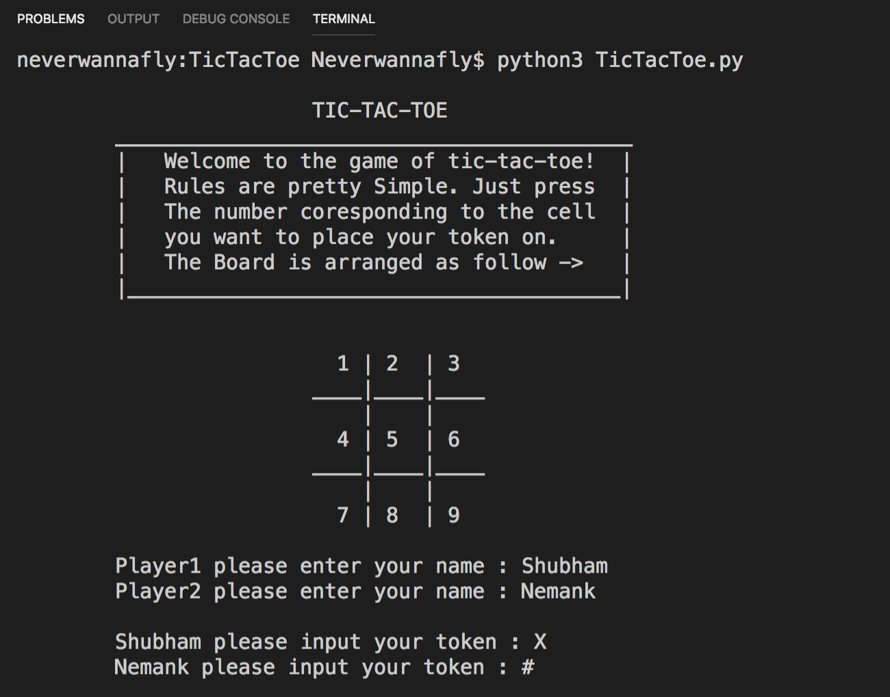
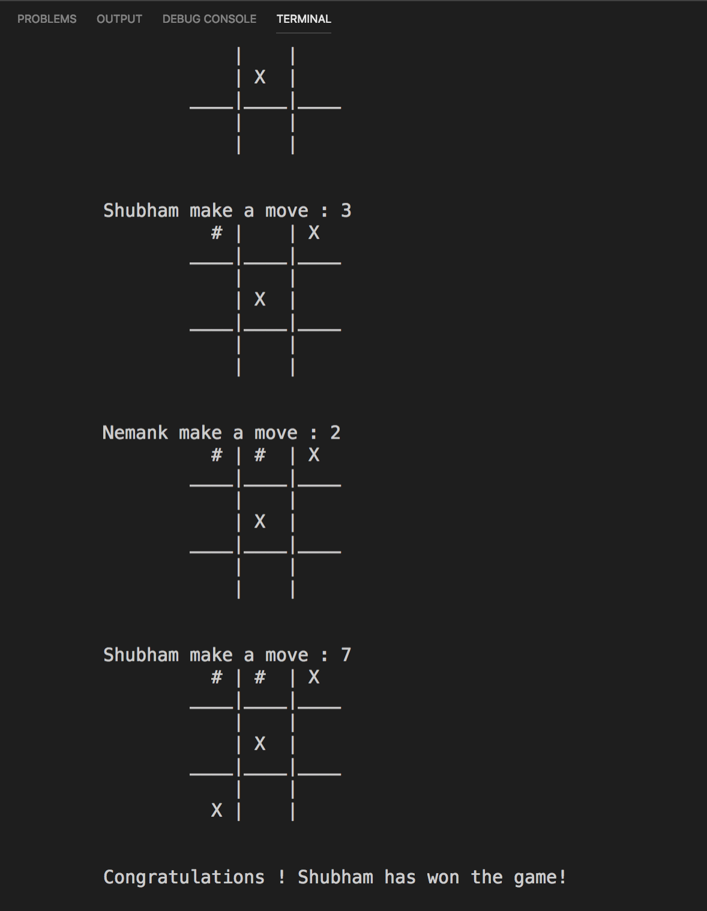

# TicTacToe

## Basic TicTacToe Game made in Python
<ul>
<li>Players can choose their own tokens to play. However the tokens must be only 1 character long.</li>
<li>Players make their moves by inputting the number corresponding to the board cell number of TicTacToe.</li>
<li>Game provides safetly against illegal moves, i.e game wont crash if you input an illegal move and would be given chances to input your move again.</li>
<li>Game has a basic restrart functionality.</li>
</ul>

## Preview
Below are previews from the game!
<p>
    </img>
</p>
<p>
    </img>
</p>

## How to Play
<ul>
<li>Download the zip
<li>Goto the project directory through terminal and enter
</ul>

```
$ python3 TicTacToe.py
```
<br>

##### Have fun and Enjoy !
##### Be sure to add in your reviews !

~@Neverwannafly